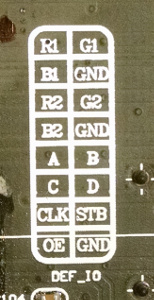

# HUB75

Library for controlling the cheap RGB matrix displays with the interface colloquially
known as hub75 with `embedded-graphics` & `embedded-hal` impls in rust.

Currently only supports panels with a resolution of 64x32 (tested on panel "P3-(2121)64*32-16S-D10").

See
[rpi-rgb-led-matrix](https://github.com/hzeller/rpi-rgb-led-matrix/blob/master/wiring.md)
for hookup instructions.

Pinout:

## Problem Solving
- It flickers

  Reduce the bits for the color output, call the `output` method more often or use a faster micro
- Some colors aren't displayed correctly/not at all

  If one of the rgb components after gamma correction has less than the provided
  bits, it isn't shown at all. For example, when using 3 color bits, having a
  value less than 124 leads to nothing being shown (as it's then gamma corrected
  to 31, which is less than 1<<5).

## Improving perforance
There are many ways to further improve performance, even being able to achieve 8 bit
color depth, unfortunately it doesn't seem possible with the current embedded-hal abstractions:

- Use binary code modulation and adjust oe time with a one-shot timer

  See [LED dimming using Binary Code
  Modulation](http://www.batsocks.co.uk/readme/art_bcm_1.htm) for further
  explanations on how binary code modulation works.

- Prerender the data, so shifting the data out is faster

  The idea is that the gpio state is precomputed and then just copied to the
  gpio output register. To do this, r1, r2, g1, g2, b1, b2 all need to be
  connected to the same port.
  Combined with binary code modulation, this will take more ram, but be much
  faster.
  The output loop can then be replaced with the dma, which will lead to greatly
  reduced cpu usage and very high refresh rates.

You might want to take a look at
[an mcu specific implementation that uses most of these things](https://github.com/david-sawatzke/36c3_led_stuff/blob/b687925f00670082cba8eab4e593b8e0da07592b/c3_display/src/hub75dma.rs)
for inspiration.

## License

Licensed under either of

- Apache License, Version 2.0 ([LICENSE-APACHE](LICENSE-APACHE) or http://www.apache.org/licenses/LICENSE-2.0)
- MIT license ([LICENSE-MIT](LICENSE-MIT) or http://opensource.org/licenses/MIT)

at your option.

## Contribution

Unless you explicitly state otherwise, any contribution intentionally submitted
for inclusion in the work by you, as defined in the Apache-2.0 license, shall be
dual licensed as above, without any additional terms or conditions.
